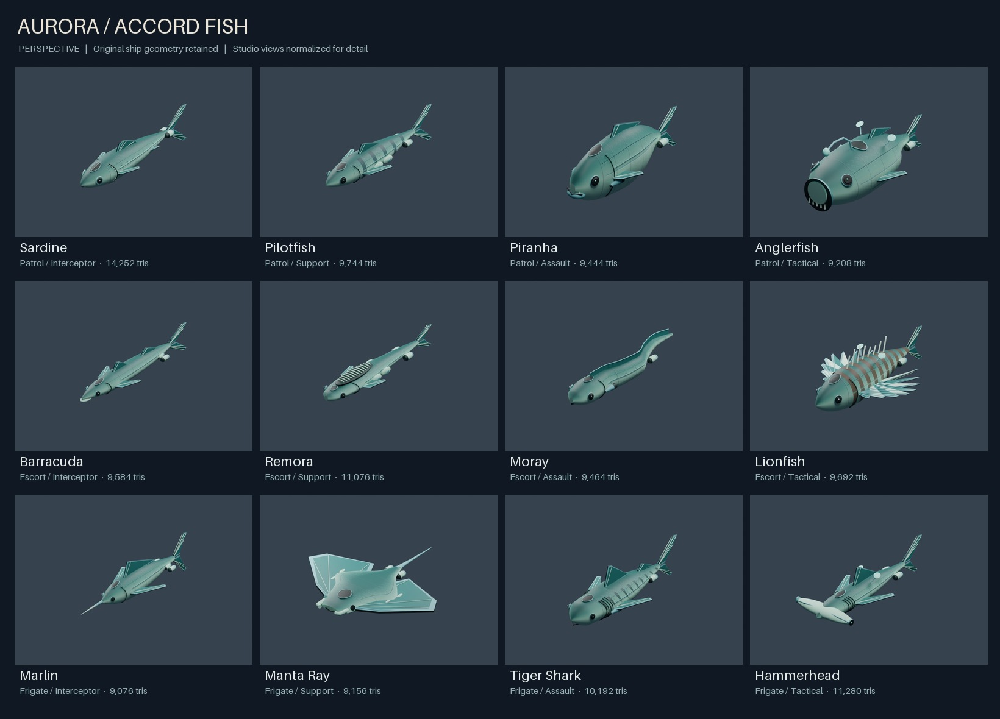
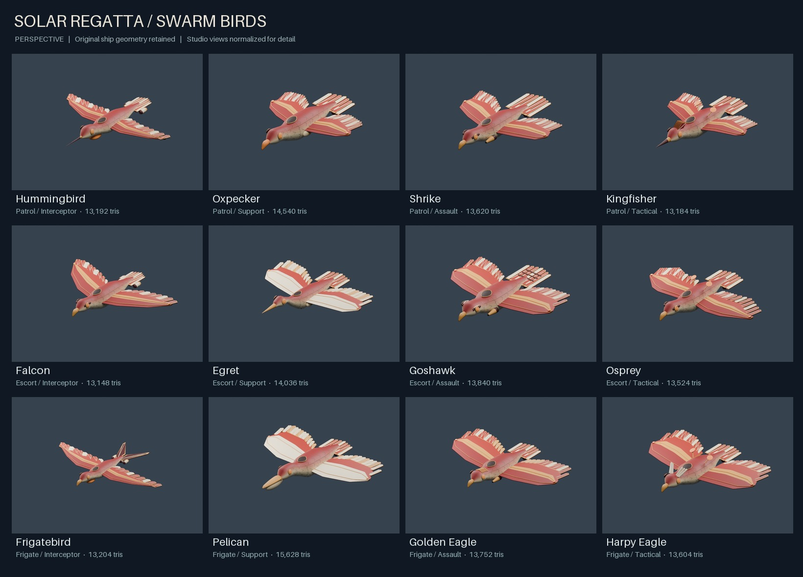
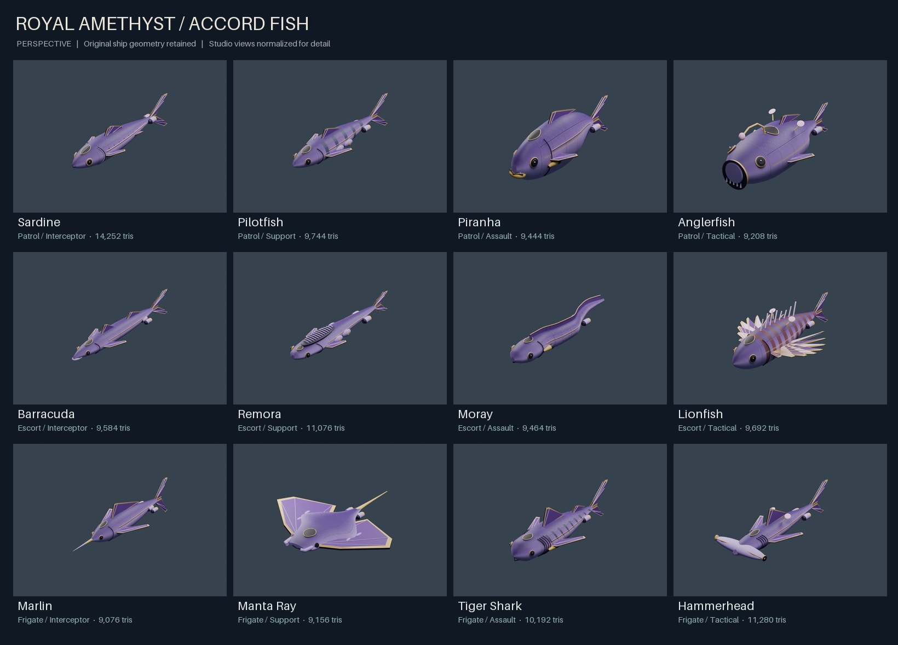
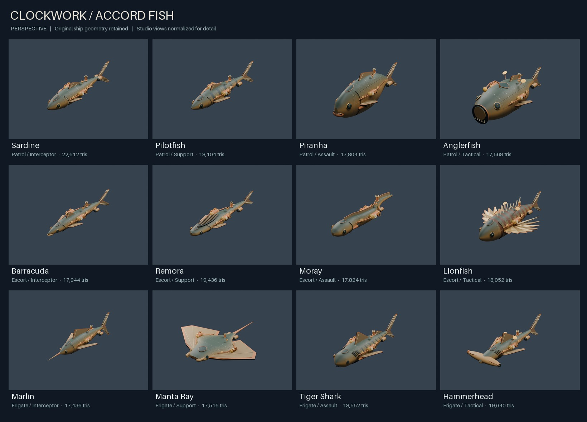
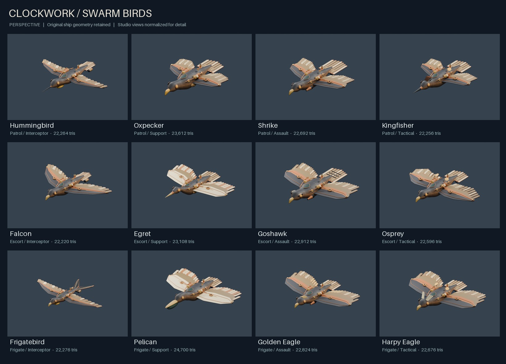

# Galaxy cosmetic library

Follow-up: Moray is straight and symmetrical. Escorts and Frigates, including
all skins, follow native 1:4:16 sizing. See `artifacts/scale/README.md`; historical
delivery notes below predate this explicitly requested revision.


Two requested parts, covering all **12 Accord fish and 12 Swarm birds** from the
merged fleet upgrade. Each model receives three paint variants and one steampunk
variant, for **96 optional cosmetics**. All are original procedural artwork.

Open [the interactive gallery](index.html) to switch collections, filter by
faction, size or species, compare to the original and download models/textures.
It runs from disk or a local web server, with no external JavaScript or fonts.

## Part 1: three recolors per ship

| Collection | Palette | Count |
|---|---|---:|
| Aurora | Deep teal, mint armor, glacial trim | 24 |
| Solar Regatta | Crimson, warm ivory, amber trim | 24 |
| Royal Amethyst | Plum, lavender, champagne gold | 24 |

Paint is authored around the existing UVs and engraved scale/feather patterns.
Species bands, spots, head masks and feather layouts remain recognizable.
All 72 recolors retain their original geometry, normals, UVs and indices exactly.
The shared collection treatment gives the shop clear collection names while
preserving each fish or bird silhouette. Three recolors were chosen within the
requested maximum of ten; there are no additional recolor tiers in this delivery.





## Part 2: Clockwork editions

These are geometry variants, not just bronze paint. All 24 models add copper
pressure vessels with brass straps, exposed pipes, raised rivets, toothed drive
wheels, analog gauges and compact pressure chimneys. Fish have heat-exchanger
ribs following their flanks. Birds have wing-root gears and exposed piston
linkages. Accord hulls use verdigris tones; Swarm hulls use darker iron tones.
Fins and feather armor take warm canvas and copper colors.

The original meshes are retained beneath these additions at their original
coordinates. Machinery is mounted using the actual body surface and wing roots.
Heads, eyes, bills, lures, crests, tails and the overall species silhouettes remain.
The gears and linkages are static. No simulated steam, smoke, moving wings,
working gauges or articulated rig is included.




The gallery includes side and top views for all Clockwork models. Paint variants
have three-quarter views. All **144 renders** show actual exported GLBs with their
embedded atlas under Blender studio lighting. There are no painted-over concepts,
added metallic shaders or hidden glow effects. Images normalize display size to
show details; the assets themselves retain the game's ship scale.

## Delivery

[`assets/skins/catalogs/cosmetics.json`](../../assets/skins/catalogs/cosmetics.json) lists every
asset, stable cosmetic ID, species mapping, bounds, hashes, thumbnail and camera.
Each variant includes a PNG atlas, portable GLB and Defold `.model` resource.
Recolor `.model` resources share the existing base geometry; Clockwork resources
reference their new geometry. See [integration notes](../../assets/skins/README.md).

This adds a library, not a working shop. Existing models, ship tables, cameras,
module slots, advanced tiers, player components, factories and multiplayer code
are unchanged. No prices or real-money purchase behavior were invented.

## Verification

`python tools/check_cosmetic_library.py --rebuild`: **PASS**.

- Complete 24 x 4 coverage and unique IDs/texture hashes.
- All 96 GLBs: chunk and accessor bounds, finite positions, unit normals,
  winding, nonzero triangle areas, 16-bit indices, UV bounds and texture size.
- All 72 recolors preserve source geometry exactly. Each of the 24 Clockwork
  variants preserves the original arrays as an exact prefix and adds machinery.
- Embedded textures match external PNGs. Model and catalog paths resolve.
- All resources and the master catalog rebuild byte for byte in an isolated
  directory: **289 files** (96 GLBs + 96 PNGs + 96 model descriptors + catalog).
- Default assets and game source compared against upstream `6a747c8`, which
  includes the merged fleet and Shaky's subsequent throttle/IPv6 fixes.
- Suggested square hangar framing checked at 120 rotations for every variant
  (**11,520 poses**). Existing 16:9 flight-camera framing also fits the variants.
- All 96 models imported successfully in Blender 4.3.2. All twelve contact sheets
  were visually reviewed, including all three Clockwork views for both factions.
- Desktop gallery checked for collection switching, species/faction/size filters,
  Clockwork top view, original comparison, incompatible-filter empty state,
  preview loading and recolor view reset. No horizontal overflow at 1935 x 1216.

The validator reads GLB bytes without importing the builders. These are builder
verification results, not a separate agent's art or code review.

**Not tested:** Defold runtime compilation/rendering, game performance, mobile
gallery layout, shop/equip integration, animations or live multiplayer cosmetics.
The library is not wired into the game, so no live player state is affected.
Each texture is 1024 x 1024. Clockwork models contain **17,436–24,700 triangles**;
they add 8,360 triangles per fish and 9,072 per bird. They remain single-mesh,
single-material models with 16-bit indices. Use an in-engine performance check
before enabling many of these variants simultaneously.

## Reproduce the review

Python dependencies: Pillow and NumPy. Rendering also needs Blender.

```text
python tools/build_cosmetic_library.py
python tools/check_cosmetic_library.py --rebuild
blender --background --python tools/render_cosmetic_review.py
python tools/build_cosmetic_gallery.py
```

The renderer supports `--ships sardine,harpy_eagle`, `--collections clockwork`,
`--views perspective,side,top`, and `--missing-only` after Blender's `--` separator.
It defaults to one view per recolor and three per Clockwork ship. Rerender changed
assets without `--missing-only` so old images are not reused.

## Scope decisions

- Three recolors per model plus one steampunk model per species.
- A consistent paint collection across the fleet, as explicitly allowed.
- Optional model resources and an asset catalog; commercial shop implementation
  remains a separate task.
- No other departures from the requested art-library work.
