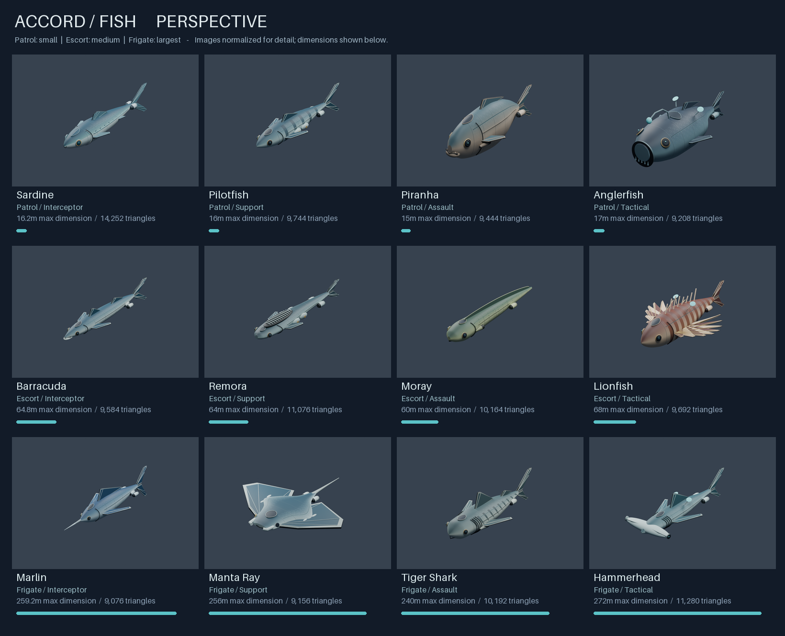
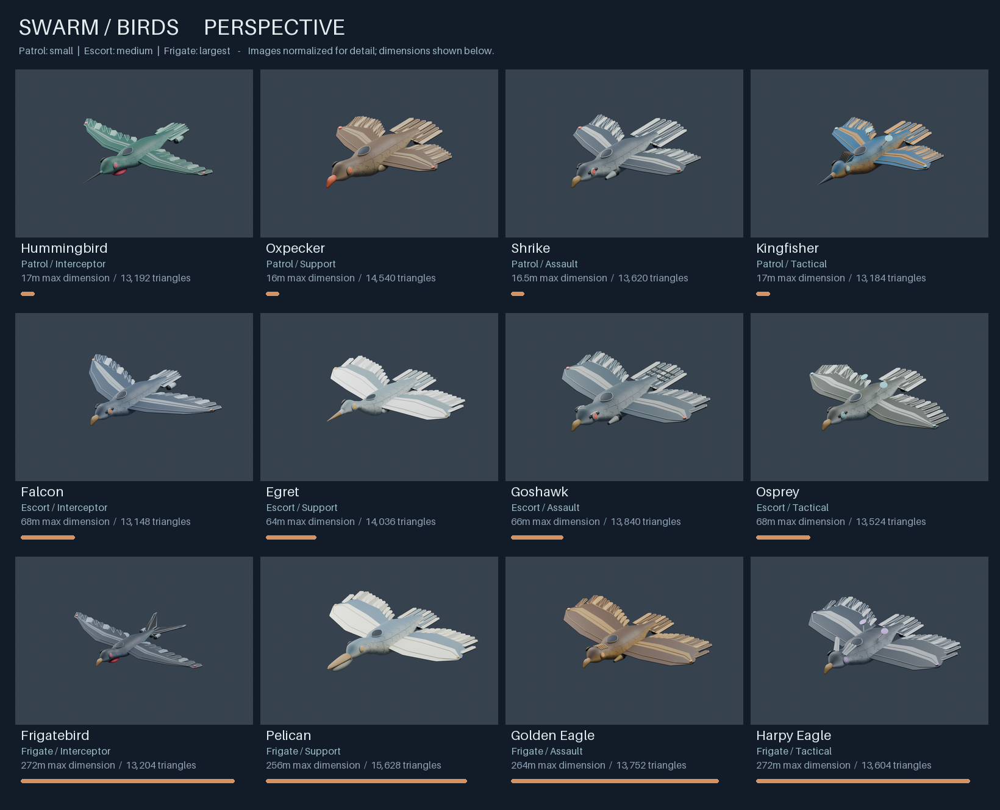

# Galaxy fleet upgrade

Built against Shaky's `master` at `dc67754`, which includes the approved Sardine
PR. Scope confirmed: the **24 ships already in the repository**, 12 Accord fish
and 12 Swarm birds. The Sardine is retained unchanged; the other **23 models** are
new original species designs. Carrier entries in the supplied chart were blank
and are not invented here. Existing advanced tiers continue to share each named
ship's model, as they did before.

## Review the models

Open [the gallery](index.html) to filter by faction and size and switch between
three-quarter, side and top views. Each card links to the actual GLB. It works
locally and has no external JavaScript, fonts or CDN dependency.





All images are Blender studio renders of the **shipped mesh and texture**.
No painted-over concepts, extra metallic materials or emission effects are used.
Gallery images normalize ship size to make detail comparable; dimension bars and
labels show their different physical sizes. These are not Defold screenshots.

## Art and size decisions

The approved Sardine established the common finish: smooth animal-shaped hulls,
engraved panels, beveled fins, round optical hardware, subdued metallic colors,
small colored details and restrained spacecraft machinery. Fish retain their
own profiles, fins, markings and head shapes. Birds use feather-like armor,
species-specific wings, beaks, eyes, tails and crests.

| Role | Patrol / small | Escort / medium | Frigate / largest |
|---|---|---|---|
| Accord interceptor | Sardine (retained) | Barracuda | Marlin |
| Accord support | Pilotfish | Remora | Manta Ray |
| Accord assault | Piranha | Moray | Tiger Shark |
| Accord tactical | Anglerfish | Lionfish | Hammerhead |
| Swarm interceptor | Hummingbird | Falcon | Frigatebird |
| Swarm support | Oxpecker | Egret | Pelican |
| Swarm assault | Shrike | Goshawk | Golden Eagle |
| Swarm tactical | Kingfisher | Osprey | Harpy Eagle |

Maximum physical dimensions (body length or wingspan, whichever is greater):

- Patrol: **15–17 m**. Sardine remains exactly 16.2 m long.
- Escort: **60–68 m**.
- Frigate: **240–272 m**.

Each same-faction, same-role trio follows 1:4:16 in longest dimension. See the
[actual-scale preview](../scale/index.html) and [revision notes](../scale/README.md).
The Moray now has the requested straight, symmetrical hull.

This intentionally replaces inconsistent old asset scales. Both factions follow
the same size bands. Interceptors carry additional visible engine nacelles;
support hulls have service cradles, assaults have gun housings, and tactical hulls
have receiver equipment. These are **visual role cues, not new gameplay slots**.
Most non-interceptor slot tables in the current repo are empty, and they remain
empty. Every gameplay value, roster ID, faction mapping and advanced-tier field
is preserved.

Shapes and finish are original code-authored art. General anatomical reference
included [NOAA's manta ray page](https://www.fisheries.noaa.gov/species/giant-manta-ray)
and [Cornell's frigatebird identification](https://www.allaboutbirds.org/guide/Magnificent_Frigatebird/id).
No BSG ship geometry or other downloaded artwork is used by the new generator.
Historical sourcing notes for replaced assets remain available in Git history.

## Technical delivery

- 23 new GLBs, each with one mesh, one material, explicit normals, UVs and
  16-bit indices; plus the unchanged Sardine.
- Matching embedded and external **1024 x 1024** base-color atlases for every
  model. Defold's existing built-in model material remains in use.
- Fleet total: **287,440 triangles**, approximately **10.6 MB of GLBs**.
  Individual models range from 9,076 to 15,628 triangles.
- Existing asset paths, +Z nose direction, player components, preview instances
  and multiplayer factories are retained. Hummingbird now explicitly binds its
  external texture in its `.model` file.
- 24 hangar cameras and 12 shared-chassis flight cameras are fitted to the actual
  new meshes. Flight framing uses both faction skins and the real horizontal
  chase-camera orientation in `player_ship.script`.
- The older Lionfish, Osprey, Pelican and Golden Eagle build entry points now
  delegate to the new generator, preventing accidental restoration of old hulls.
- Six fleet contact sheets, 72 per-ship renders, a portable review gallery, a
  generated manifest and a machine-readable validation report.

The generic fitting-screen schematic and module-slot marker layout are outside
this model pass. Legacy, unreferenced top-down PNGs remain on disk; the old
per-ship generator commands now produce the current GLB/texture/model resources.

## Verification

`python tools/check_fleet_models.py --rebuild` **PASS**:

- All 24 GLBs: binary chunk/buffer bounds, index limits, nonzero triangle areas,
  winding versus normals, finite values, unit normals, UV bounds and texture size.
- Embedded image equals the external Defold texture byte for byte.
- All 24 models have distinct geometry files and existing player/remote/roster
  references. All size bands are strictly separated.
- Hangar projection checked at **120 yaw angles per model** (2,880 poses), using
  the square preview; wider sale cards fit as well.
- All 12 flight cameras checked against both faction meshes at the configured
  16:9 aspect ratio and 0.7-radian FOV.
- Gameplay data compared with the upstream base after excluding only camera
  settings, comments and formatting. No balance/slot/faction changes.
- Approved Sardine GLB, texture and generator verified against upstream.
- All 69 newly generated resources (23 GLBs, textures and model descriptors)
  regenerated in an isolated directory and compared byte for byte.

Blender 4.3.2 imported all models and rendered every ship from three angles.
All six contact sheets were visually reviewed. An initial tail-feather overlap
was corrected before final rendering. A transient Windows GLB write failure was
retried successfully; the exporter now stages replacements so such a failure
cannot truncate the last usable GLB.

The gallery's faction, size and view filters were exercised in the browser,
including the four Swarm frigates in top view and restoring all 24 ships.
The desktop layout was visually checked. All four legacy build entry points
reproduced the current resources in temporary directories, and rerunning the
camera integration left both Lua files byte-identical.

These are builder verification results, not a separate agent's independent art
review. The validator reads the exported binary independently of the generator.

**Not tested:** Defold runtime rendering, browser/mobile performance, live
multiplayer or resized gameplay-camera aspect ratios. Atlas memory and crowded
multi-ship scenes need an in-engine performance check before release. The new
models do not add normal-map, glow or PBR shader support.

## Rebuild

Python dependencies: Pillow and NumPy (NumPy is used by the validator and the
existing Sardine pipeline). Blender is only needed for studio renders.

```text
python tools/build_fleet_models.py
python tools/integrate_fleet_models.py
python tools/check_fleet_models.py --rebuild
blender --background --python tools/render_fleet_review.py -- --ships all
python tools/build_fleet_gallery.py
```

`--ship <slug>` rebuilds one model, and `--output-root <directory>` stages assets
elsewhere. A full fleet build is required before integrating camera metadata.
The standalone Sardine generator remains unchanged.

## Scope adjustments

- User confirmed the existing 24-ship roster rather than adding another 24.
- Old inconsistent model sizes were normalized to the requested size hierarchy;
  cameras were updated to match, including the camera shared by Sardine/Hummingbird.
- Obsolete asset-source comments and four obsolete generators were replaced with
  current descriptions/entry points. Stats and gameplay code were preserved.
- No other departures from the approved fleet upgrade.
